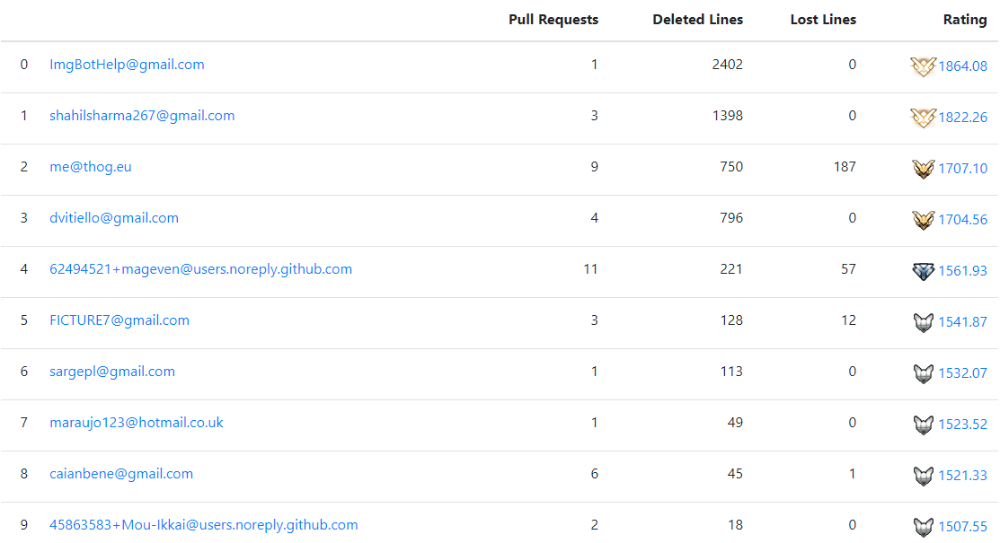

This action builds a rating of contributors by the stability of code. 
You can compete with each other and earn XP for pull requests.

## Demo

[](https://devrating.net/#/repositories/sgUj3bYc7wXTAXjF5DN0ON7lTTT2/Ryujinx%2FRyujinx)

## Usage

Just throw this to `.github/workflows/devrating.yml` in your repo:

```yaml
name: Updating ranks in devrating.net
on:
  pull_request:
    branches: [ main ]  # Put your dev branch
    types: [ closed ]
jobs:
  devrating:
    runs-on: ubuntu-latest
    steps:
    - uses: actions/checkout@v2
      with:
        fetch-depth: 0

    - uses: victorx64/devrating-gh-action@v0
```

Then, **close** a pull request to initiate the action.

## Support

It should be clear how to use. If not, ask us in
our [Telegram chat](https://t.me/devratingchat).